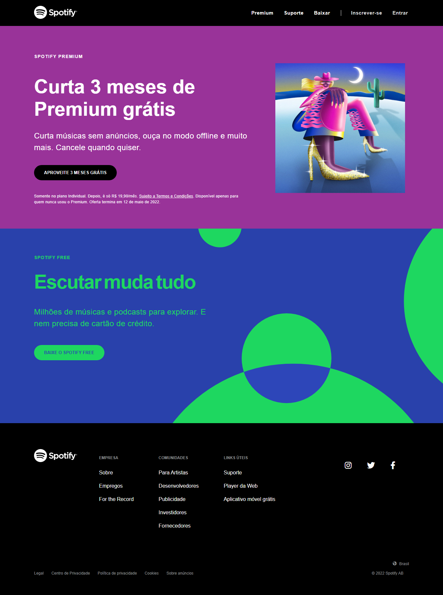

<h1 align="center">
  Spotify Clone
</h1>

  

 

## 🛠️ Tecnologias

Esse projeto foi desenvolvido utilizando as tecnologias:

- HTML
- CSS

## 🚀 Sobre o Projeto

Esse projeto é um clone do site do spotify feito com o objetivo de praticar meus conhecimentos em HTML e CSS. Até o momento disponível apenas a versão para desktop, porém pretendo fazer melhorias futuramente, adicionado responsividade e compatibilidade com dispositivos móveis.

Live Preview: https://edusmpaio.github.io/spotify-clone/
